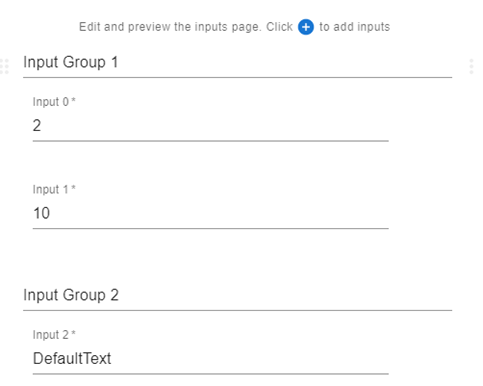

# Quick Overview

**MecsimCalc** is a platform that enables building and sharing computational tools or _**apps**_ using Python on the web. To use **MecsimCalc**, one does not require prior knowledge of HTML, CSS, or Javascript. In a matter of minutes, one can transform any snippet of Python code to a computational _**app**_ available to the entire world wide web.

In the documentation, the term _**developer**_ is used to refer to the person who is developing an _**app**_ on the platform, while the term _**user**_ is used to refer to the person who would be using the _**app**_ after development. Following six simple steps, as described below, the _**developer**_ can create an _**app**_ available to categories of _**users**_ on the world wide web.

## Step 1: Info

In the Info stage, the _**developer**_ specifies the _**app’s**_ name, description, category, and tags. This information can later help **_users_** search and find the app. The _**developer**_ can also upload different images associated with the _**app**_ to appear in search results.

## Step 2: Inputs

In the Inputs stage, the _**developer**_ specifies the types and format of the inputs required from the _**user**_ to run the _**app**_. This stage also allows the developer to test how the inputs page responds to the _**user’s**_ input.

By hovering over the  sign, the _**developer**_ can add "input groups" and different types of input. “Input groups” are used for visually grouping inputs. The _**developer**_ starts by adding an input group under which different inputs can be added. The following example shows two input groups: “Input Group 1” and “Input Group 2”. “Input Group 1” has two numerical inputs with default values of 2 and 10 while “Input Group 2” has a text input with a default value of: “DefaultText”.

<div style={{textAlign: 'center'}}>



</div>

The _**developer**_ can navigate to the preview section to view how the input page appears to the **_user_**:

<div style={{textAlign: 'center'}}>


</div>

When hovering over any of the added inputs, the edit icon  appears allowing the _**developer**_ to edit the variable specifying its type, variable name (to be used at the later stages), default values, precision for numerical inputs, and other settings.

## Step 3: Code

In the code stage, the **_developer_** is expected to write a python function called: `main(inputs)`. Available to the function `main` are the input variables created in the inputs stage. The `main` function is expected to return a dictionary whose key values are available in the output stage.

By clicking on `<> Input Variables` on the top right of the screen in this step, the _**developer**_ can view and copy the names of the input variables available for the `main` function.

As an example the following `main` function adds two numerical inputs (`input_0` and `input_1`) and returns their sum (`out1`). It also returns the third text input (`input_2`) as (`out2`):

```python
def main(inputs):
    out1=inputs['input_0']+inputs['input_1']
    out2=inputs['input_2']
    return {"Sum":out1,"Message":out2}
```

The dictionary keys ("Sum" and "Message") are available for the _**developer**_ to embed their values anywhere in the output page.

## Step 4: Output

In the output stage, the **_developer_** designs a **smart** output page of the **_app_** using a user interface allowing for different formatting styles. The dictionary key values output at the code stage can be embedded anywhere in the output page using the syntax `{{outputs.key}}`. As an example, the following output page displays the values of `Sum` and `Message` generated in the example shown in the code step.

<div style={{textAlign: 'center'}}>


</div>

The _**developer**_ can also use conditional logic in designing the output page. By clicking on `if` or `for` in the toolbar, the syntax needed for these logical expressions is generated for the _**developer**_ to use. As an example, the following output page displays the value of the `Sum` only if it is greater than 0.

<div style={{textAlign: 'center'}}>


</div>

## Step 5: Docs

In this stage, the **_developer_** can provide a documentation page on how to use the _**app**_, or any references or other relevant information for the _**app**_

## Step 6: Preview

In this final stage, the _**developer**_ can test the _**app**_ and publish it once satisfied.
